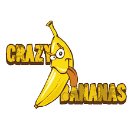

<!-- Improved compatibility of back to top link: See: https://github.com/othneildrew/Best-README-Template/pull/73 -->

<!--
*** Thanks for checking out the Best-README-Template. If you have a suggestion
*** that would make this better, please fork the repo and create a pull request
*** or simply open an issue with the tag "enhancement".
*** Don't forget to give the project a star!
*** Thanks again! Now go create something AMAZING! :D
-->

<!-- PROJECT SHIELDS -->
<!--
*** I'm using markdown "reference style" links for readability.
*** Reference links are enclosed in brackets [ ] instead of parentheses ( ).
*** See the bottom of this document for the declaration of the reference variables
*** for contributors-url, forks-url, etc. This is an optional, concise syntax you may use.
*** https://www.markdownguide.org/basic-syntax/#reference-style-links
-->

<!-- PROJECT LOGO -->
 

<!-- ABOUT THE PROJECT -->
## About The Project

This is the source code for our ISS project phase-2. We've only implemented the frontend and some backend for now.\
**Note:** Welcome.html is the landing page

Use the `README.md` to get started.

## Usage

    To use this effectively one must know the following:

1.  Admin credentials are `admin` and `admin`.

<!-- CONTACT -->
## Contact

Anurag - [@anurag.peddi](anurag.peddi@students.iiit.ac.in) \
Aryanil - [@aryanil.panja](aryanil.panja@research.iiit.ac.in)\
Mrudul - [@mrudul.penakula](mrudul.penakula@students.iiit.ac.in)